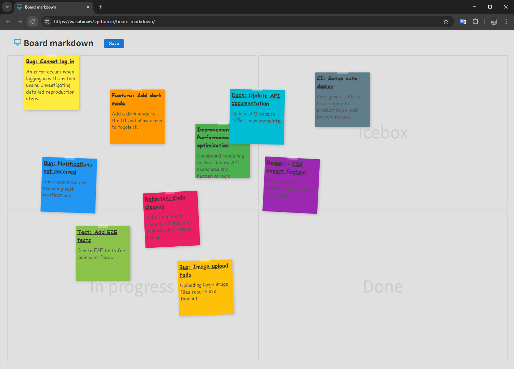

# board-markdown
Board markdown

[Demo](https://wasabina67.github.io/board-markdown/)



> [!NOTE]
> Although the title says "Markdown", the initial data is managed in JSON. 🥺

## dev

```bash
npm run dev
```

## build

```bash
npm run build && git add -A && git commit -m "build"
```

## lint

```bash
npm run lint && bash spellcheck.sh
```
